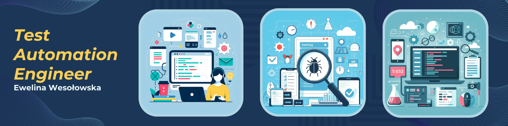
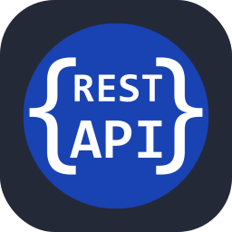
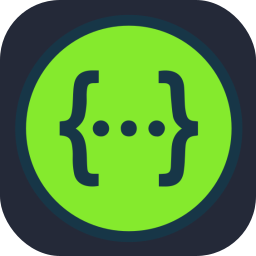
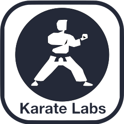
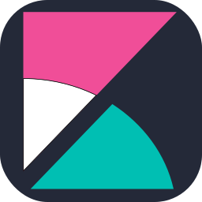
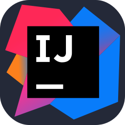

    

## 👩🏻‍💻 About Me

•  🎭 Exploring the depths of Playwright testing framework and other tools. 
•  🔍 Forever on the hunt for bugs to squash and systems to streamline. 
•  🛠️ Crafting automated testing solutions that shine brightly. 
•  ⚡ Converting caffeine into code that operates seamlessly while you rest. 
•  💼 Working commercially in the IT industry since 2017. 

## 🛠️ Tools & Technologies

  
  
  
  
  
  
  
  
  
  
  
  
  
  
  
  
  
  
  
  

## 🚀 My Skills

•  🤖 Automation Testing 
•  🛠️ Test Frameworks (Playwright + TypeScript/JavaScript) 
•  📊 Continuous Integration/Deployment (GitHub Actions, Jenkins) 
•  🐛 Bug Hunting and Tracking 
•  🌐 API Testing and Validation (Playwright, Postman, Karate DSL) 
•  💻 Proficiency in test design techniques for creating effective and comprehensive test cases 
•  📊 I'm planning to learn Performance Testing (with Artillery) 
•  📱 Mobile App Testing 
•  🧪 Agile Collaboration (Scrum) 
•  🧪 Traditional Collaboration (Waterfall) 
•  🌟 English Proficiency: B2 

## 📝Certificates

### 🟠 Test Automation with Playwright

Certificate confirming skills in building a professional testing framework using Playwright Test, GUI and API tests.

#### Certificate Details

- **Name:** [Test Automation with Playwright](https://jaktestowac.pl/membership/kursant-programu-testy-automatyczne-z-playwright/)
- **Issuing Organization:** [TESTONEO Sp. z o.o.](https://jaktestowac.pl/)
- **Date of Issue:** 29/04/2024
- **Credential ID:** bca7 ***** d928
- **Verification:** [Link to Verification Page](https://jaktestowac.pl/certs/)

### 🟠 Automation with Playwright: Mastering Web Automation with AI

#### Certificate Details

- **Name:** [Automation with Playwright: Mastering Web Automation with AI](https://university.engenious.io/courses/8)
- **Issuing Organization:** [Engenious University](https://engenious.io/contact-us)
- **Date of Issue:** 26/09/2024

### 🟠 ISTQB certificate

#### Certificate Details

- **Name:** [ISTQB](https://sjsi.org/ist-qb/)
- **Issuing Organization:** [Stowarzyszenie Jakości Systemów Informatycznych](https://sjsi.org/o-nas/kontakt/)
- **Date of Issue:** 10/2018

## 📂 Current projects

<!--  -->
I am developing an automated testing project in which I use the Playwright + TypeScript
framework. Ultimately, the projects will include test plans, test scenarios and a CD\CI pipeline. 
Check out the repositories!

• [GAD App Tests](https://github.com/ew-code/GAD-App-Tests)  
• [Demo Bank App Tests](https://github.com/ew-code/Demo-Bank-App-Tests)  
• [Demo Bank App with GitHub Actions](https://github.com/ew-code/playwright-demobank-actions/tree/master)  
• [NGX Cypress Tests](https://github.com/ew-code/NGX-CYPRESS-TEST) 
<!-- • Test Scenario for Demo Bank App   -->

## 📊 My Github Stats

<!-- ## 📫 Contact -->

<!-- If you have any questions or suggestions, feel free to contact me:   -->
<!--  -->
<!--  -->
